# Caulobacter

Alphaproteobacteria, Caulobacter использовались в анализе.

[Ссылка на colab](https://colab.research.google.com/drive/1_5P72lwLC4ZLEUQdjOeQWWKfvtPD_CWY?usp=sharing)

# ОБщая информация
Анализируемые организмы: *Caulobacter flavus*, *Caulobacter henricii*, *Caulobacter mirabilis*, *Caulobacter rhizosphaerae*, *Caulobacter segnis*

# общая таблица

| Species  |  Genes number | Genome coverage | Genome length | Genome_plasmid length | Number of sequences |
|---|--|--|---|--|---|
| C_flavus |	5236.00	| 89.71	| 5659202.00	| 5659202.00 |	1.00 |
| C_henricii |	3693.00	| 89.84	| 3864204.00	| 3957288.00 |	2.00 |
| C_mirabilis |	4385.00	| 91.59 |	4577265.00	| 4577265.00 |	1.00 |
| C_rhizosphaera |	5288.00 |	89.44| 	5732418.00 |	5963910.00 |	2.00 |
| C_segnis |	4411.00 |	90.65 |	4655467.00 |	4655467.00 |	1.00 |


**Гистограмы ZH-Score**
|   |   |
|---|---|
| 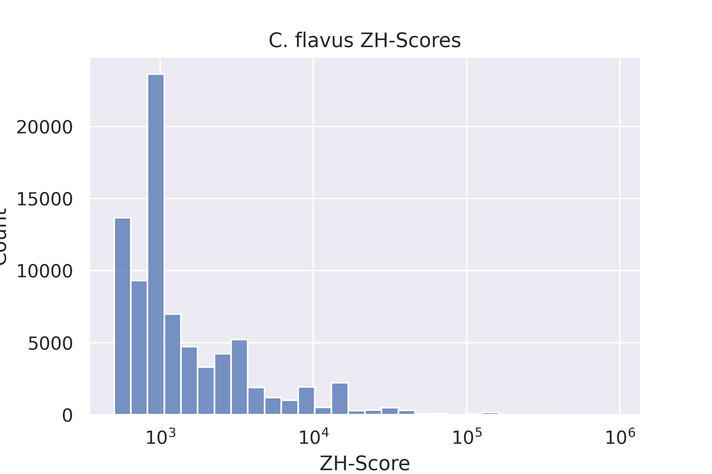 | 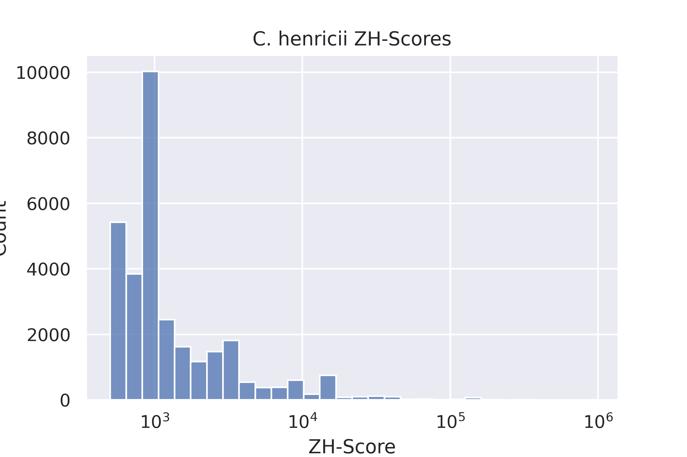  |
|  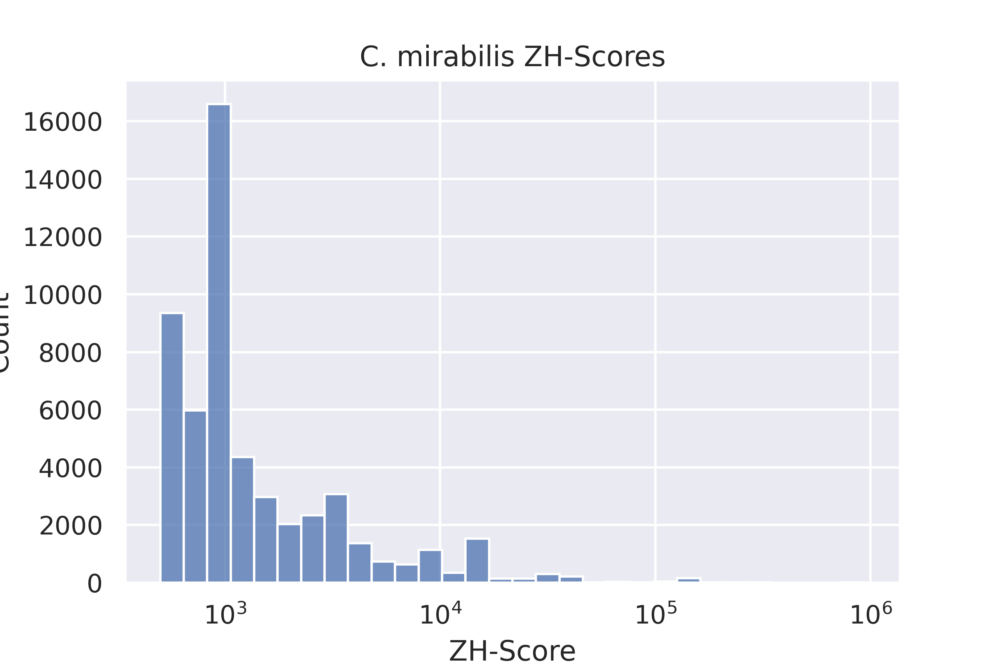 | 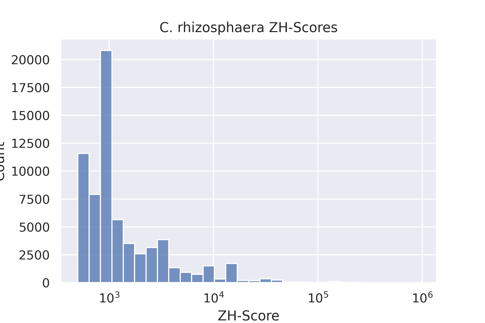  |
| 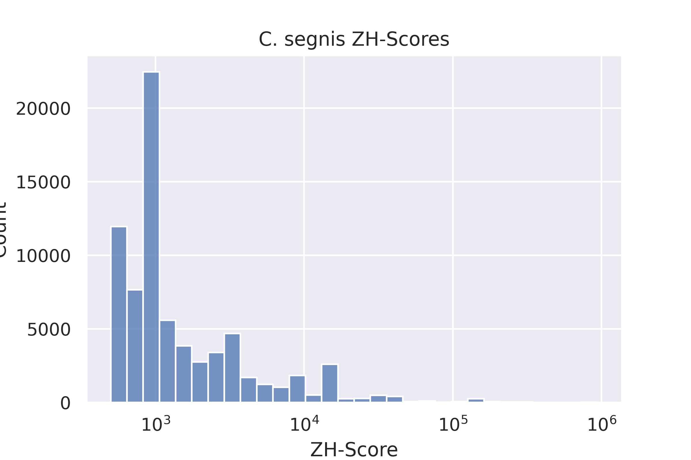  |  |

**homologuous clusters**

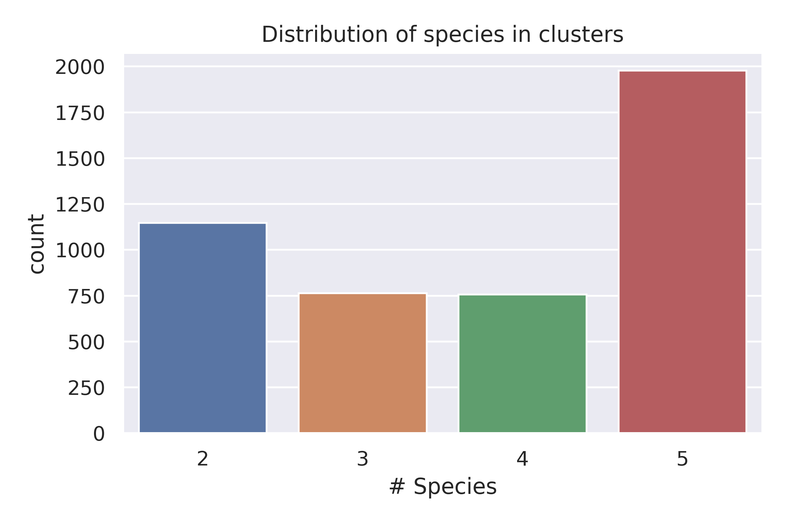
number of clusters: 4644


# Число участков Z-DNA и их длина

| Species  |  C_flavus	| C_henricii |	C_mirabilis |	C_rhizosphaera	| C_segnis |
|---|--|--|---|--|---|
| Number of Z-DNA regions| 81688	| 31202 |	53558	| 66835	| 73335 | 
| Z-DNA length  | 322820	| 126852	| 214626 |	269193	| 276327 |


*визуализация Z-DNA в промоторах*
|   |   |
|---|---|
| 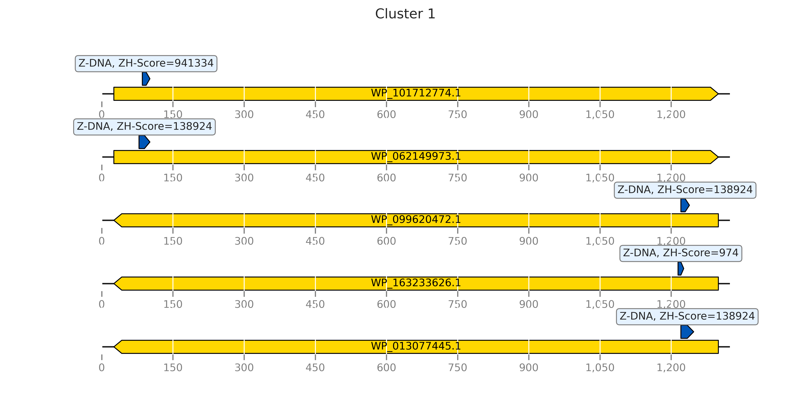 | 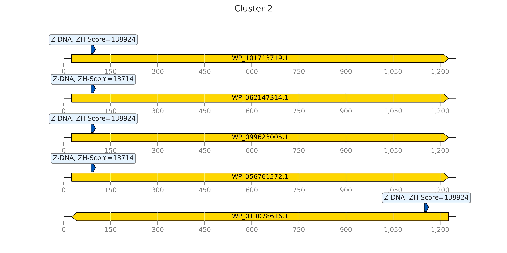  |
|  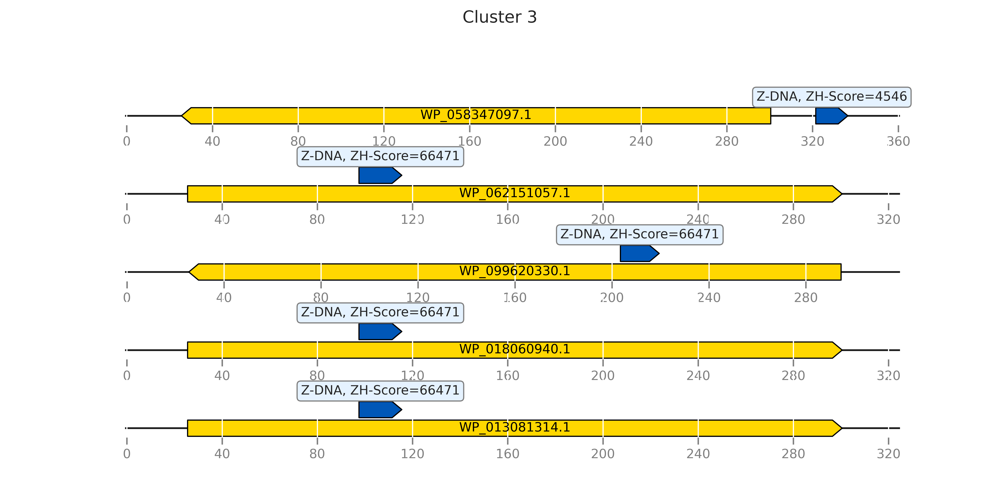 | 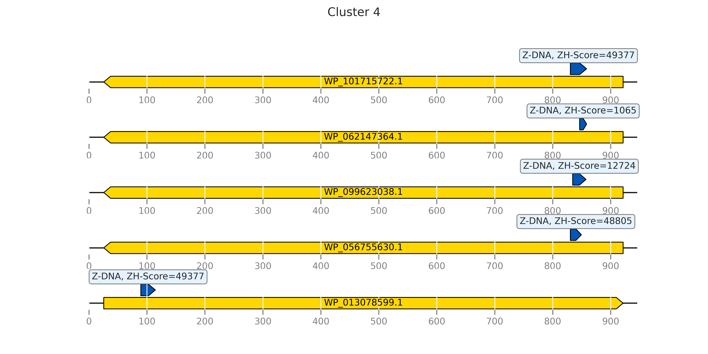  |
| 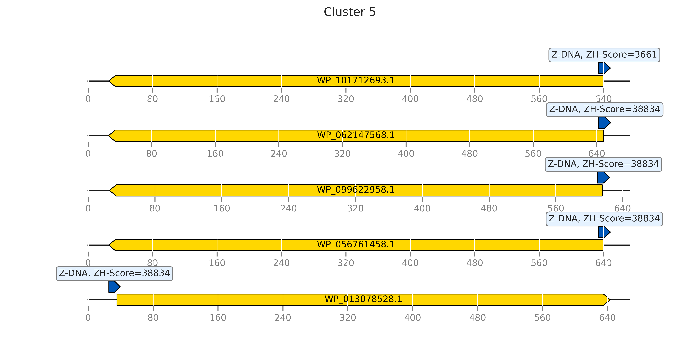  | 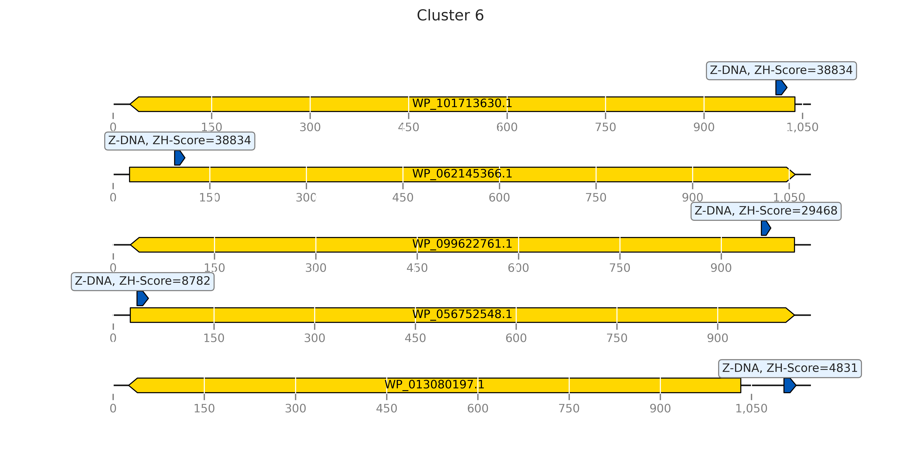   |
| 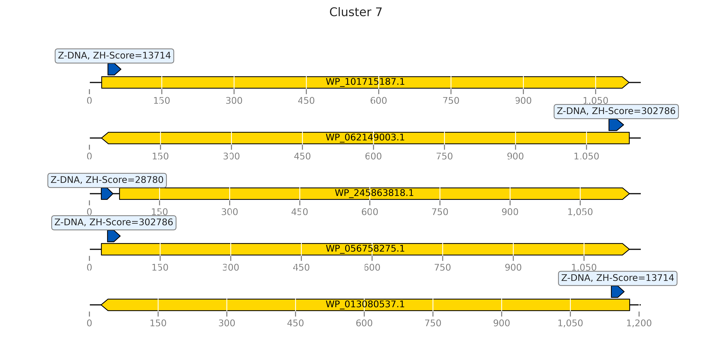  | 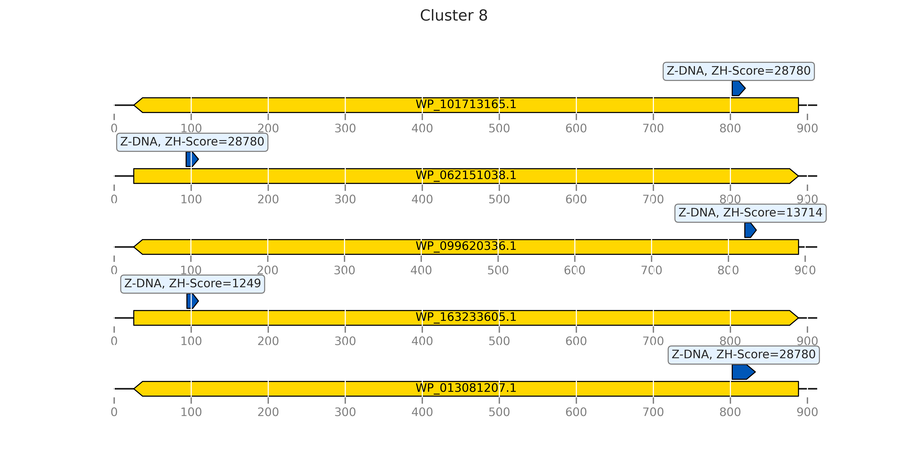   |


## Multiple protein alignment
Files are in the folder *aligment*, one of alignements is provided here

<details>
<summary>Cluster 1 alignment</summary>

```

WP_101712774.1      MDDAAGGLQATMRAMGQAAREGARALRLATPAQRTAALTAIAAAIRADAPAILGANARDL
WP_163233626.1      MDDAGMSLQATMTAMGQAARHGASALRVATPAQRTAALQAMAAAIRADAPAILAANARDL
WP_099620472.1      MDDGAVSLQATMTAMGQAAREGARALRLSTPEQRTAAIRAMAQAIRDDAQAILAANQRDQ
WP_062149973.1      MDDAGVSLQAKMIAMGEAARAGARALRLASAEQRTTALQAMAKAIREDAAPILAANARDI
WP_013077445.1      MDDAGVSLQATMADMGRTAREGARALRLATPEQRTAAIRAMAAEIRKAAPAILAANAQDL
                    ***.. .***.*  **.:** ** ***:::. ***:*: *:*  **  * .**.** :* 

WP_101712774.1      EKAGANGLTPPMIERLMLNEARLEGVAAGVEAVAAIPDPLGVETARWTRPNGLDIARVRT
WP_163233626.1      DKAGAGGLTAPMVERLMLNAERLEGVAAGLEAVAAIPDPLGVETARWTRPNGLDIARVRT
WP_099620472.1      AAARDAGLAAPMIDRMMLDAGRLEGVAQGVEAVAGIPDPLGVETARWTRPNGLDIARVRT
WP_062149973.1      AQAKANGLSGPMLDRLLLDEARLEAMAAGVEVVAALADPLGVATARWTRPNGLDIARVRT
WP_013077445.1      SRAEANGVSGPMLDRLALDEKRLEGVAAGVEAVAEIADPLGVATSRWTRPNGLDISRVRT
                      *   *:: **::*: *:  ***.:* *:*.** :.***** *:**********:****

WP_101712774.1      PIGVIAMIYESRPNVTADAAALTLRSGNAVILRGGSECIESNLAIHAAVVKGLTAAGLPH
WP_163233626.1      PIGVIAMIFESRPNVTADAAALCVRSGNAVILRGGSECLQSNLAIHAAIAKGLKAAGIST
WP_099620472.1      PIGVIAIIYESRPNVTADAAALCVRSGNAAILRGGSECIRTNQALHAAVAKGLTAAGLPA
WP_062149973.1      PIGVIAMIYESRPNVTADAAALCVRSGNAVILRGGSECLASSLAIHAAIVRGLKAAGLPA
WP_013077445.1      PIGVIAMIYESRPNVTADAAALCVRSGNAVILRGGSECIASNLAIHTAIERGLETAGLPA
                    ******:*:************* :*****.********: :. *:*:*: :** :**:. 

WP_101712774.1      QVVQMVRTTDRAAVGAILSGLDRSIDLIIPRGGKSLVARVQAEARAPVLGHLEGLNHVFV
WP_163233626.1      DAVQIVRTPDRDAVGAILSGLDRTIDLIIPRGGKSLVARVQQEARVAVLGHLEGLNHVFV
WP_099620472.1      ACVQVVKTSDRAAVGHILSGLDRTIDLIIPRGGKSLVARVQAEARAPVLGHLEGLNHVYV
WP_062149973.1      SAVQAVGTADRAAVGHILAGLNRAVDLIIPRGGKSLVARVQAEARAPVLGHLEGLNHVFV
WP_013077445.1      SAVQAVKTPDRAAVGMILQGLDRSIDLIIPRGGKSLVARVQAEARAPVLGHLEGLNHVFV
                      ** * *.** *** ** **:*::**************** ***..***********:*

WP_101712774.1      HEAADLKKAADIVLNAKMRRVSVCGSAETLLIDRAAAGKLLPPIADVLIKAGCEIRGDAA
WP_163233626.1      HAAADPRKAVDIVLNAKMRRVSVCGAAETLLVDRAAASRLLPPIADALIKAGCELRGDGP
WP_099620472.1      DAEADVAKARDIVLNAKMRRVSVCGAAETLLVDAKAAERLLPPVADALIRAGCELRGDAR
WP_062149973.1      HAAADPRKAVEIALNAKMRRVSVCGSAETLLVDRAVADRLLPLLADALIKAGCELRGDAA
WP_013077445.1      HAAADPKKAVDIVVNAKLRRVSVCGSAETLLVDKVAAETLLPPIAQALLVAGCELRGDAA
                    .  **  ** :*.:***:*******:*****:*  .*  *** :*:.*: ****:***. 

WP_101712774.1      ARAIEPELKAAAVEDWTTEYLAPIIAVAVVDGVEGAAQHIATYGSGHTDAIVTEDAAAAE
WP_163233626.1      SRAIEPTMKPAIEADWSTEYLAPTISVAVVDGVEGAAAHIAAYGSGHTDAILTEDAAAAE
WP_099620472.1      ARAIEPTMAAATIEDWTTEYLAPTIAVAVVDGVEGAAAHIASYGSGHTDAIVTENAATAE
WP_062149973.1      ALVIEPTMKKAQEADWSTEYLAPILSVAVVDGVAGAAAHIARYGSGHTDAIVTEDAAAAE
WP_013077445.1      ARAIVPAMKAATTEDWTTEYLAAILAVAVVDGVEGAAAHIAAFGSGHTDAIVTEDEAAAE
                    : .* * :  *   **:*****. ::******* *** *** :********:**: *:**

WP_101712774.1      RFVSQVDSAIVLVNASTQFADGGEFGFGAEIGIATDKLHARGPVGAEQLTTFKYVVRGTG
WP_163233626.1      RFVALVDSAIVLVNASTQFADGGEFGFGAEIGIATDKLHARGPVGAEQLTTFKYVVRGTG
WP_099620472.1      RFTALVDSAIVLINASTQFADGGEFGFGAEIGIATDKLHARGPVGAEQLTTFKYVVRGTG
WP_062149973.1      AFAAEVDSAIVLINASTQFADGGEFGFGAEIGIATDKLHARGPVGAEQLTTFKYVVRGTG
WP_013077445.1      TFVAAVDSAIVLVNASTQFADGGEFGFGAEIGIATDKLHARGPVGAEQLTTFKYVVRGTG
                     *.: *******:***********************************************

WP_101712774.1      QTRP
WP_163233626.1      QTRP
WP_099620472.1      QTRP
WP_062149973.1      QTRP
WP_013077445.1      QTRP
                    ****

```
 
</details>

# Предсказание G-квадруплексов

## Number of quadruplex regions and quadruplex length

| Species  |  A_caviae	| A_dhakensis |	A_encheleia	| A_hydrophila | A_media |
|---|--|--|---|--|---|
| Number of quadruplex regions | 3919	| 2998 |	3149 |	2815 |	3302 | 
| Quadruplex length  | 121057 |	91507 |	96600 |	85445 |	101636 |


**aaa distribution**
|   |   |
|---|---|
|  |   |
|  |   |
|   |  |


**Quadruplexes visualization**
|   |   |
|---|---|
|  |   |
|   |   |
|   |    |
|   |    |

R-scripts used for the analysis can be gained via:
<details>
<summary>pqsfinder</summary>

```
!wget https://raw.githubusercontent.com/narek01/hse22_project/main/pqsfinder.r
  
```
  
<details>
<summary>configure</summary>
  
```
  
!wget https://raw.githubusercontent.com/narek01/hse22_project/main/configure.r

```
<details>

